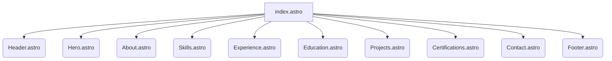

# My Personal Portfolio


This is a personal portfolio website built with Astro, designed to showcase my projects, skills, experience, and certifications.

## Features

*   **Modern Stack:** Built with Astro for fast performance and a great developer experience.
*   **Responsive Design:** Optimized for various screen sizes, from mobile to desktop.
*   **Tailwind CSS:** Styled with Tailwind CSS for utility-first styling and easy customization.
*   **Modular Components:** Organized into reusable Astro components for maintainability.

## Getting Started

To get a local copy up and running, follow these simple steps.

### Prerequisites

Make sure you have Node.js (which includes npm) installed on your machine.

*   npm
    ```sh
    npm install npm@latest -g
    ```

### Installation

1.  Clone the repo
    ```sh
    git clone git@github.com:ezetina86/Portfolio.git
    ```
2.  Navigate to the project directory
    ```sh
    cd Portfolio
    ```
3.  Install NPM packages
    ```sh
    npm install
    ```

### Development

To start the development server:

```sh
npm run dev
```

This will start a local development server, usually at `http://localhost:4321`.

### Build

To build the project for production:

```sh
npm run build
```

This command will generate a `dist/` directory with all the static assets.

### Preview

To preview the production build locally:

```sh
npm run preview
```

## Project Structure

```
.astro/
public/
src/
├── components/ # Reusable Astro components (e.g., Header, Footer, Hero)
├── data/       # Data files for content (e.g., certifications, experience)
├── layouts/    # Astro layouts for consistent page structure
├── pages/      # Astro pages (e.g., index.astro)
├── scripts/    # JavaScript files for interactivity
└── styles/     # Global styles and animations
```

## Page Architecture

The main `index.astro` page composes various components to form the complete portfolio layout.



## Deployment

After running `npm run build`, the `dist/` directory contains the static files ready for deployment. You can deploy this directory to any static site hosting service (e.g., Netlify, Vercel, GitHub Pages).

## License

Distributed under the MIT License. See `LICENSE` for more information. (Note: You might need to create a LICENSE file if you don't have one.)

## Contact

Enrique Zetina - [jenzetin@gmail.com](mailto:jenzetin@gmail.com)
Project Link: [https://github.com/ezetina86/Portfolio](https://github.com/ezetina86/Portfolio)
